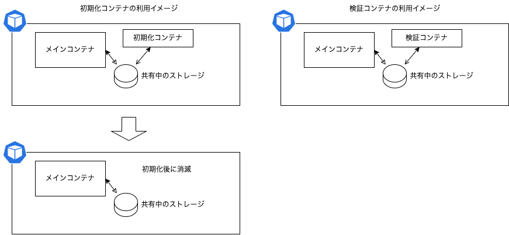

# ローカルリソースの利用

あまり現実的ではありませんが、K8sではローカルリソースの利用も可能です。

- hostPath
  - Podの動くノードのディレクトリを割り当てることができます
  - 応用例として、Docker Desktop等のホストのディレクトリを(Dockerのコンテナ空間を跨いで)利用することができます
    - macOSであれば普通に使えます
    - Windowsの場合、エディションによっては使えないことがあります
- emptyDir
  - Podの動くノード上で適当なディレクトリを作って割り当ててくれます(作ったばかりなので空になる)
  - Podが削除されると一緒に削除されます
  - 一時ファイルの置場として使えます

## hostPathを使ってみる

実際に使ってみましょう。

`pod-sample.yml`を`pod-sample-hostpath.yml`としてコピーし、以下のように変更します。

```{literalinclude} src/pod-sample-hostpath.yml
:language: yaml
:diff: src/pod-sample.yml
```
※ 変更後のコード例は[こちら](src/pod-sample-hostpath.yml)を参照してください

- `volumes[0]`にて`hostPath`を指定しています
  - `path`にてホストのディレクトリを指定します
    - ここでは、他とバッティングしにくいよう、`/tmp`以下にディレクトリを用意させています(無い時は作成してくれます)
  - `type`にてディレクトリかファイルかを指定します
    - ただし今回は『存在しない』可能性があるため、`DirectoryOrCreate`を指定しています(無ければ作成する)

このマニフェストを適用し、pod/test-pod-hostpathを作成して確認してみましょう。

```pwsh
PS> kubectl apply -f pod-sample-hostpath.yml
pod/test-pod-hostpath created
PS> kubectl get pod test-pod-hostpath # Runningまで待つ
```

PodがRunningになったら、中に入ってみましょう。

```pwsh
PS> kubectl exec -it test-pod-hostpath -- /bin/sh
# ls /test-hostpath  # <- 現時点では存在しないため出力が無い
#
# echo "Hello, hostpath!" > /test-hostpath/hello.txt
# ls /test-hostpath
hello.txt
```

ファイルをひとつこしらえています。
一度このPodを削除して、再度作成することでどうなるか、確認してみましょう。

```pwsh
PS> kubectl delete pod test-pod-hostpath # 約30秒待たされることがあります
PS> kubectl apply -f pod-sample-hostpath.yml # 再適用して作成し直す
# 待つ部分は省略
PS> kubectl exec -it test-pod-hostpath -- ls /test-hostpath # ファイルが残っているか確認
hello.txt <-- ちゃんと残ってる!>
```

という具合に、再利用可能な形になっています。

## Pod間での共有

`hostPath`によるボリュームは、**同一ノード内であれば共有可能です**。
ためしに、 `pod-sample-hostpath.yml`をコピーして別のファイルを作り、中の固有名などを変更してみます。

```{literalinclude} src/pod-sample-hostpath2.yml
:language: yaml
:diff: src/pod-sample-hostpath.yml
```

この場合、適用して作成されたPod(test-pod-hostpath2)は、同じノード上に作成されるため、`/tmp/test-hostpath`ディレクトリを共有しています。

```pwsh
PS> kubectl apply -f pod-sample-hostpath2.yml
# 待つ部分は省略
$ kubectl exec test-pod-hostpath2 -- ls /test-hostpath
hello.txt
```

このように、同一ノード上であれば、`hostPath`によるボリュームは共有可能です。2側でファイルをtouchで作成し、元のPodで見えることも検証しておくといいでしょう。

同様に、同一Pod内の異なるコンテナでも共有可能です。
この仕組みを利用することで、Pod内のデータ共有が可能になります。

```{note}
この仕組みを利用することで、Pod内でのコンテナの使い方の幅が広がります。

- 初期化を行うコンテナを用意することで、本来のコンテナでは持っていないデータを投入する
- 動作検証を行うコンテナを用意することで、本来のコンテナに影響を及ぼさずに検証ができるようになります



```

## emptyDirを使ってみる

`emptyDir`は、Podのライフサイクルに合わせてディレクトリを作成し、削除するボリュームです。
作成する場所はノードの側で適当に決めてくれるので、一時的な利用に向いています。

`pod-sample-hostpath.yml`にて、ボリュームをひとつ追加してみましょう。

```{note}
下記の差分では変更後ファイル名が`pod-sample-emptydir.yml`となっていますが、実際には`pod-sample-hostpath.yml`に追記する形で進めてください(組版システム側の都合です)。
```

```{literalinclude} src/pod-sample-emptydir.yml
:name: pod-sample-hostpath.yml
:language: yaml
:diff: src/pod-sample-hostpath.yml
```

※ 変更後のソースコードは[こちら](src/pod-sample-emptydir.yml)を参照してください(ファイル名は`pod-sample-hostpath.yml`ですがこちらも名前が違います)

```{note}
注意点として、`emptyDir`を作成する際、マニフェストの仕様の関係で、`emptyDir`キーに対する値が何か必要とされてしまっているところです。ここでは空の辞書を置くことで対応しています。
```

一度マニフェスト逆適用で削除後、再度適用して動きを見ることにしましょう。
```
PS> kubectl delete -f pod-sample-hostpath.yml
# 30秒ほど待ってPodが消えたところでやってみる
PS> kubectl apply -f pod-sample-hostpath.yml
# 待つ部分は省略
PS> kubectl exec -it test-pod-hostpath -- touch /test-emptydir/something.txt # 空ファイルを作成
PS> kubectl delete -f pod-sample-hostpath.yml # 破棄(また30秒ぐらい)
PS> kubectl apply -f pod-sample-hostpath.yml # 再作成
# 待つ部分は省略
PS> kubectl exec -it test-pod-hostpath -- ls /test-emptydir # 消えてるはず…
PS>
```

emptyDirは、何かの作業を行う際に一時ファイルを置いておく目的で使うことになります。
**Podが消滅する際に消えることだけは十分に理解しておいてください**。


## おまけ: ホスト側は見えないのか?

`hostPath`によるボリュームは、うまく使うと、ホスト側のディレクトリをPodに見せることもできる場合があります。
ただしこれは開発中の場合はいいものの、本番運用を考慮した場合は使えません(理論上は可能でもセキュリティ上の懸念があるため)。

Docker Desktopの場合、ある程度の条件を満たせば可能です

- macOS版のDocker Desktopの場合、リソース設定(ダッシュボードの{menuselection}`設定-->Resources-->File Sharing`)にて、ホスト側のディレクトリを指定することで、K8sのノードからアクセス可能なストレージを作成することができます。
  - というか、初期設定で入っているので、特に設定は不要です
    ```{figure} images/dd-macOS-resources.png
    :alt: macOS版Docker Desktopのリソース設定

    macOS版 Docker Desktopのリソース設定(ファイル共有)
    ```
- Windows版のDocker Desktopの場合、WSL2にて動いているので、WSL2上では共有が可能になっています(`/mnt/c`や`/mnt/host/c`等)が、検証した環境では、ディレクトリがあってもマスクされてしまったのか、アクセスできませんでした

いずれにしても、アクセス権的な問題や、コンテナ上の不備からホスト側のファイルが破壊されるとたまったものではありません。
使わないことが一番です。なのでこれ以上はここでは論じないことにします。

