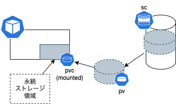

# ストレージの概念

K8sにおいても、ストレージはもちろん存在します。
コンテナが動くためには当然ストレージが必要です。

ですが、コンテナにおけるストレージは、通常のストレージと少し異なる概念が入っています。
ただしこのこと自体はここまでの学習において感じていたと思います。

# 消えるストレージと消えないストレージ

コンテナにおけるストレージは、コンテナが消えるとともに消えるものと、コンテナが消えても残るものがあります。

- コンテナ自体は終了時にその動作を止めます、止めた後再開(最初から走らせる)ことはできます
- ですが、コンテナが終了時などに『消滅』した場合は、その中にあるデータは消滅します
  - つまり、コンテナの中に重要なデータがあった場合、一緒に消えてしまうことになります
  - この手の現象は、コンテナが『ephemeral』であると言われます ※『揮発性』
- 大切と思われるデータをコンテナが消滅した際に残すためには、コンテナの外にデータを保管する必要があります
  - このようなデータを保管する場所を『永続化ストレージ』と言います

# 永続化ストレージを作るためには

コンテナの外側に永続的なストレージを作り、それを利用するという考え方は、docker時代に少し触っていました。

- ホスト側のディレクトリをマウントする(`-v`スイッチでホスト側ディレクトリのパスを渡していたケース)
- ボリュームを作成してマウントしていたケース(`-v`でボリュームを渡していたケース)

K8sにおいても同様のメカニズムが用意されていますが、大きな概念として『ストレージの抽象化』があります。



## ストレージの抽象化とは

K8sは、その実装の背景にストレージが存在しています。
ストレージはK8sと関係なくそれぞれの環境で用意されていたため、実は統一されていません。

- Google(GCP)であればGoogle Cloud Storage
- Amazon(AWS)であればS3
- Microsoft(Azure)であればAzure Blob Storage

といった具合に、クラウドプロバイダにより、ストレージの管理方法が異なります。

またオンプレミス(自分で環境構築をしている)場合ならが、[NFS](https://ja.wikipedia.org/wiki/Network_File_System)や[Ceph](https://ceph.io/en/)、[GlusterFS](https://www.gluster.org/)などのストレージを利用することがあります。
もしくは、ポッドの動くノードが持っているディレクトリや、メモリストレージ(いわゆるRAMディスク)を利用することもできます。
マニフェストを設計し、利用する側がこのような情報を基に選定することは可能ですが、非常に面倒になることがあります。

そこで、K8sではこれらのストレージを抽象化し、それを利用するためのリソースを提供しています。

### StorageClass(sc)

ストレージクラス(StorageClass)は、K8sにおいてストレージを抽象化するためのリソースです。長いので`sc`と略されます。
scは、ストレージのプロビジョニング(展開)を行うためのリソースです。
上記にあげていた各ストレージのメカニズムを抽象化して、利用できるようにしてくれています。

### PersistentVolume(pv)

永続化ストレージを抽象化したリソースがPersistentVolume(pv)です。長いので`pv`と略されます。
pvは、実際のストレージを抽象化したリソースで、いわばストレージクラスの切り出しのようなものです。
すなわち実際のストレージを抽象化したものです。

普通はpvを生成した時点でフォーマットされており、利用する側はボリュームとしてマウントできます。

ただしpvは生成時に特定のscを指定する必要があります。そのため、利用する環境に依存する可能性があります。

### PersistentVolumeClaim(pvc)

永続化ストレージを利用するためのリソースがPersistentVolumeClaim(pvc)です。長いので`pvc`と略されます。
pvcは抽象化されており、以下の情報を開示することで、該当するpvを生成して、それを利用することができます。
- どのpvやscを利用するか(ここは直接的)
- どのような容量を利用するか
- どのようなアクセスモードで利用するか
- どのような属性のストレージを求めているのか(各scによりラベルが付与されていることがある)
  - ハードディスクのように、スピードが遅いが大容量のもの
  - SSDのように、スピードが速いが容量が小さいもの
  - 揮発性のあるもの etc


# pvc利用の流れ

pvcを利用する流れは、基本的には以下の通りとなります。

1. scを作成する
2. pvを作成する
3. pvcを作成する
4. ポッドにpvcをマウントする

ただし、K8s環境が構築されている時点で、利用可能なscはいくつか用意されています
(K8sの仕様として組み込まれているものと、クラウドプロバイダが用意したもの)。

用意されているscから意図的にpvを作って、pvcとして割り当てることも可能ですが、
一般的には、pvcを作成することでscに対して要求を出し、それに応じてpvが生成されることが多いです。
この操作を『ダイナミック(動的)プロビジョニング』と言います。

1. pvcを作成し、マニフェストとして適用する
2. K8sの環境では、その条件に見合うpvがあるか探す(あれば割り当てる)
3. 見合うpvが無い場合、scに対してpvを生成するよう要求する
4. 用意されたpvをpvcに割り当てる

この授業では、k8sの開発環境のため、ローカルのディレクトリをpvとして利用します。そのためのscが用意されているため、pvcを用意すれば適当な空間をpvとして切り出してきてくれます。


```{note}
今回はpvの話は省略していますが、実際の運用ではpvの作成を自前で行うこともあります。
なぜなら、pvの元となるscは、クラウドプロバイダ側では課金対象のため、ダイナミックプロビジョニングの際に無駄に大きなストレージを構築すると、それが原因でコスト高になることが考えられるためです。

つまり、事前にpvを用意することで、(コスト的にも)適切なストレージを用意することができると考えられます。
```
